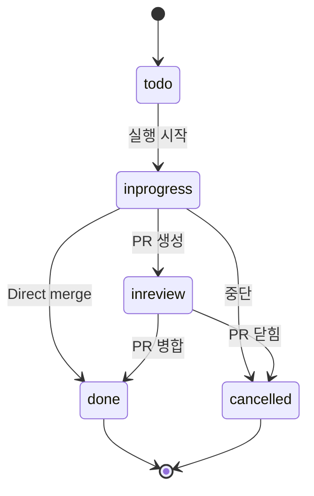

# 테이블 상세 문서

## 목차
1. [projects](#projects)
2. [tasks](#tasks)
3. [task_attempts](#task_attempts)
4. [execution_processes](#execution_processes)
5. [executor_sessions](#executor_sessions)
6. [execution_process_logs](#execution_process_logs)
7. [merges](#merges)
8. [drafts](#drafts)
9. [images](#images)
10. [task_images](#task_images)
11. [tags](#tags)

---

## projects

Git 저장소 기반 프로젝트 정보를 저장하는 루트 엔티티.

### 컬럼 정의

| 컬럼명 | 타입 | 제약 | 설명 |
|--------|------|------|------|
| `id` | BLOB (UUID) | PRIMARY KEY | 프로젝트 고유 식별자 |
| `name` | TEXT | NOT NULL | 프로젝트 표시 이름 |
| `git_repo_path` | TEXT | NOT NULL UNIQUE | Git 저장소 절대 경로 (예: `/Users/user/project`) |
| `setup_script` | TEXT | NULLABLE | 환경 설정 스크립트 (예: `npm install && npm run build`) |
| `dev_script` | TEXT | NULLABLE | 개발 서버 실행 스크립트 (예: `npm run dev`) |
| `cleanup_script` | TEXT | NULLABLE | 정리 스크립트 (worktree 삭제 전 실행) |
| `copy_files` | TEXT | NULLABLE | 복사할 파일 목록 (JSON 배열 형식) |
| `created_at` | TEXT (ISO8601) | NOT NULL, DEFAULT | 생성 시각 (서브초 정밀도) |
| `updated_at` | TEXT (ISO8601) | NOT NULL, DEFAULT | 최종 수정 시각 |

### 인덱스
- **PRIMARY KEY**: `id`
- **UNIQUE**: `git_repo_path` (동일 저장소 중복 등록 방지)

### 비즈니스 로직

**git_repo_path 중복 검증**:
```rust
// 프로젝트 생성 전 중복 체크
let existing = Project::find_by_git_repo_path(pool, &git_repo_path).await?;
if existing.is_some() {
    return Err(ProjectError::GitRepoPathExists);
}
```

**스크립트 실행 우선순위**:
1. `setup_script`: TaskAttempt 생성 시 1회 실행
2. `dev_script`: 개발 서버 시작 (사용자 요청 시)
3. `cleanup_script`: Worktree 삭제 전 정리 작업

**copy_files 형식**:
```json
[".env.example", "config/local.json"]
```

### 관련 쿼리

**가장 활발한 프로젝트 조회** (최근 task_attempts 기준):
```sql
SELECT p.*
FROM projects p
WHERE p.id IN (
    SELECT DISTINCT t.project_id
    FROM tasks t
    INNER JOIN task_attempts ta ON ta.task_id = t.id
    ORDER BY ta.updated_at DESC
)
LIMIT 10
```

---

## tasks

프로젝트 내 작업 항목 (기능 개발, 버그 수정 등).

### 컬럼 정의

| 컬럼명 | 타입 | 제약 | 설명 |
|--------|------|------|------|
| `id` | BLOB (UUID) | PRIMARY KEY | 태스크 고유 식별자 |
| `project_id` | BLOB (UUID) | NOT NULL, FK | 소속 프로젝트 |
| `title` | TEXT | NOT NULL | 태스크 제목 (간략한 설명) |
| `description` | TEXT | NULLABLE | 상세 설명 (Markdown 지원) |
| `status` | TEXT (ENUM) | NOT NULL, DEFAULT 'todo' | 태스크 상태 |
| `parent_task_attempt` | BLOB (UUID) | NULLABLE, FK | 부모 TaskAttempt (서브태스크 생성 시) |
| `created_at` | TEXT (ISO8601) | NOT NULL, DEFAULT | 생성 시각 |
| `updated_at` | TEXT (ISO8601) | NOT NULL, DEFAULT | 최종 수정 시각 |

### 제약조건

**status ENUM**:
```sql
CHECK (status IN ('todo','inprogress','done','cancelled','inreview'))
```

**외래 키**:
- `project_id` → `projects(id)` ON DELETE CASCADE
- `parent_task_attempt` → `task_attempts(id)` (Self-reference)

### 인덱스
- **PRIMARY KEY**: `id`
- **복합 인덱스**: `(project_id, created_at DESC)` (프로젝트별 최신 태스크 조회)

### 상태 전이도



### 비즈니스 로직

**프롬프트 생성**:
```rust
pub fn to_prompt(&self) -> String {
    if let Some(description) = self.description.as_ref().filter(|d| !d.trim().is_empty()) {
        format!("{}\n\n{}", &self.title, description)
    } else {
        self.title.clone()
    }
}
```

**계층 구조** (parent_task_attempt):
- AI 에이전트가 작업 중 새로운 태스크 생성 가능
- `parent_task_attempt`로 어떤 실행에서 생성되었는지 추적
- 부모 TaskAttempt 삭제 시 `parent_task_attempt = NULL` (고아 처리)

### 관련 쿼리

**프로젝트별 태스크 + 실행 상태**:
```sql
SELECT
  t.*,
  CASE WHEN EXISTS (
    SELECT 1 FROM task_attempts ta
    JOIN execution_processes ep ON ep.task_attempt_id = ta.id
    WHERE ta.task_id = t.id AND ep.status = 'running'
  ) THEN 1 ELSE 0 END AS has_in_progress_attempt
FROM tasks t
WHERE t.project_id = ?
ORDER BY t.created_at DESC
```

---

## task_attempts

태스크 실행 시도. Git worktree 기반 격리 환경에서 실행.

### 컬럼 정의

| 컬럼명 | 타입 | 제약 | 설명 |
|--------|------|------|------|
| `id` | BLOB (UUID) | PRIMARY KEY | 시도 고유 식별자 |
| `task_id` | BLOB (UUID) | NOT NULL, FK | 소속 태스크 |
| `container_ref` | TEXT | NULLABLE | Worktree 경로 또는 클라우드 컨테이너 ID |
| `branch` | TEXT | NOT NULL | Git 브랜치 이름 (이 시도에서 작업하는 브랜치) |
| `target_branch` | TEXT | NOT NULL | 병합 대상 브랜치 (예: `main`, `dev`) |
| `executor` | TEXT | NOT NULL | 사용할 AI 에이전트 (예: `CLAUDE_CODE`, `GEMINI`) |
| `worktree_deleted` | BOOLEAN | NOT NULL, DEFAULT 0 | Worktree 삭제 여부 (cleanup 완료) |
| `setup_completed_at` | TEXT (ISO8601) | NULLABLE | Setup 스크립트 완료 시각 |
| `created_at` | TEXT (ISO8601) | NOT NULL, DEFAULT | 생성 시각 |
| `updated_at` | TEXT (ISO8601) | NOT NULL, DEFAULT | 최종 수정 시각 |

### 외래 키
- `task_id` → `tasks(id)` ON DELETE CASCADE

### 인덱스
- **PRIMARY KEY**: `id`
- **복합 인덱스**: `(task_id, created_at DESC)` (태스크별 최신 시도)
- **단일 인덱스**: `(created_at DESC)` (전역 최신 시도 목록)

### 비즈니스 로직

**Worktree 관리**:
```rust
// Worktree 생성 시
container_ref = Some(format!("{}/worktrees/{}", git_repo_path, attempt_id))
worktree_deleted = false

// Worktree 정리 후
worktree_deleted = true
```

**Branch 관리**:
- `branch`: 이 시도에서 커밋을 푸시할 브랜치
- `target_branch`: PR/병합 시 병합될 대상 브랜치
- 자식 태스크 생성 시, 자식의 `target_branch = 부모의 branch`

**Cleanup 정책**:
- 72시간 동안 활동 없는 worktree 자동 삭제
- 삭제 대상: `worktree_deleted = FALSE` AND 마지막 활동 > 72시간

### 관련 쿼리

**만료된 Worktree 조회**:
```sql
SELECT ta.id, ta.container_ref, p.git_repo_path
FROM task_attempts ta
LEFT JOIN execution_processes ep ON ta.id = ep.task_attempt_id
JOIN tasks t ON ta.task_id = t.id
JOIN projects p ON t.project_id = p.id
WHERE ta.worktree_deleted = FALSE
  AND ta.id NOT IN (
    SELECT DISTINCT task_attempt_id FROM execution_processes
    WHERE completed_at IS NULL
  )
GROUP BY ta.id
HAVING datetime('now', '-72 hours') > MAX(COALESCE(ep.completed_at, ta.updated_at))
```

---

## execution_processes

실행 프로세스 이력. Setup, AI 에이전트, Dev Server 등 모든 실행을 시간순으로 기록.

### 컬럼 정의

| 컬럼명 | 타입 | 제약 | 설명 |
|--------|------|------|------|
| `id` | BLOB (UUID) | PRIMARY KEY | 프로세스 고유 식별자 |
| `task_attempt_id` | BLOB (UUID) | NOT NULL, FK | 소속 TaskAttempt |
| `run_reason` | TEXT (ENUM) | NOT NULL | 실행 이유 |
| `executor_action` | TEXT (JSON) | NOT NULL | 실행 액션 상세 정보 |
| `before_head_commit` | TEXT | NULLABLE | 실행 전 Git HEAD 커밋 OID |
| `after_head_commit` | TEXT | NULLABLE | 실행 후 Git HEAD 커밋 OID |
| `status` | TEXT (ENUM) | NOT NULL, DEFAULT 'running' | 실행 상태 |
| `exit_code` | INTEGER | NULLABLE | 프로세스 종료 코드 |
| `dropped` | BOOLEAN | NOT NULL, DEFAULT 0 | 히스토리에서 제외 여부 (restore 시) |
| `started_at` | TEXT (ISO8601) | NOT NULL, DEFAULT | 실행 시작 시각 |
| `completed_at` | TEXT (ISO8601) | NULLABLE | 실행 완료 시각 |
| `created_at` | TEXT (ISO8601) | NOT NULL, DEFAULT | 레코드 생성 시각 |
| `updated_at` | TEXT (ISO8601) | NOT NULL, DEFAULT | 레코드 수정 시각 |

### ENUM 정의

**run_reason**:
```sql
CHECK (run_reason IN ('setupscript', 'cleanupscript', 'codingagent', 'devserver'))
```

**status**:
```sql
CHECK (status IN ('running', 'completed', 'failed', 'killed'))
```

### 외래 키
- `task_attempt_id` → `task_attempts(id)` ON DELETE CASCADE

### 인덱스
- **PRIMARY KEY**: `id`
- **복합 인덱스**: `(task_attempt_id, created_at ASC)` (시도별 실행 순서)
- **단일 인덱스**: `(status)` (실행 중 프로세스 조회)

### executor_action JSON 구조

**CodingAgentInitialRequest**:
```json
{
  "typ": {
    "CodingAgentInitialRequest": {
      "executor_profile_id": "CLAUDE_CODE",
      "user_message": "Implement user authentication",
      "image_paths": []
    }
  }
}
```

**CodingAgentFollowUpRequest**:
```json
{
  "typ": {
    "CodingAgentFollowUpRequest": {
      "executor_profile_id": "CLAUDE_CODE",
      "user_message": "Fix the login redirect issue",
      "image_paths": []
    }
  }
}
```

**Script**:
```json
{
  "typ": {
    "Script": {
      "script_content": "npm install"
    }
  }
}
```

### 비즈니스 로직

**Git Commit Tracking**:
```rust
// 실행 전
before_head_commit = Some(get_current_head_oid())

// 실행 후
after_head_commit = Some(get_current_head_oid())
```

**Dropped (Soft Delete)**:
- Restore 기능 사용 시, 특정 프로세스 이후의 실행을 `dropped = TRUE`로 마킹
- UI에서는 `dropped = FALSE`인 프로세스만 표시
- Processes 탭에서는 모든 프로세스 확인 가능

**이벤트 소싱 패턴**:
- 모든 실행을 삭제하지 않고 보존
- 시간순 정렬로 히스토리 재구성 가능
- Diff 계산: `before_head_commit..after_head_commit`

### 관련 쿼리

**실행 중인 프로세스 조회**:
```sql
SELECT * FROM execution_processes
WHERE status = 'running'
ORDER BY created_at ASC
```

**특정 시도의 전체 히스토리** (dropped 제외):
```sql
SELECT * FROM execution_processes
WHERE task_attempt_id = ?
  AND dropped = FALSE
ORDER BY created_at ASC
```

---

## executor_sessions

AI 에이전트 세션 정보. 각 execution_process와 1:1 매핑.

### 컬럼 정의

| 컬럼명 | 타입 | 제약 | 설명 |
|--------|------|------|------|
| `id` | BLOB (UUID) | PRIMARY KEY | 세션 고유 식별자 |
| `task_attempt_id` | BLOB (UUID) | NOT NULL, FK | 소속 TaskAttempt |
| `execution_process_id` | BLOB (UUID) | NOT NULL, FK | 대응하는 실행 프로세스 |
| `session_id` | TEXT | NULLABLE | 외부 AI 서비스 세션 ID |
| `prompt` | TEXT | NULLABLE | 전송된 프롬프트 |
| `summary` | TEXT | NULLABLE | AI 응답 요약 (최종 메시지) |
| `created_at` | TEXT (ISO8601) | NOT NULL, DEFAULT | 생성 시각 |
| `updated_at` | TEXT (ISO8601) | NOT NULL, DEFAULT | 최종 수정 시각 |

### 외래 키
- `task_attempt_id` → `task_attempts(id)` ON DELETE CASCADE
- `execution_process_id` → `execution_processes(id)` ON DELETE CASCADE

### 인덱스
- **PRIMARY KEY**: `id`
- **단일 인덱스**: `(task_attempt_id)` (시도별 세션 조회)
- **단일 인덱스**: `(execution_process_id)` (프로세스별 세션 조회)
- **단일 인덱스**: `(session_id)` (외부 세션 ID 조회)

### 비즈니스 로직

**세션 생성 플로우**:
1. ExecutionProcess 생성 (status = 'running')
2. ExecutorSession 생성 (session_id = NULL)
3. AI 서비스 시작 후 외부 session_id 파싱
4. ExecutorSession.session_id 업데이트

**세션 재개 (Resume)**:
```rust
// 최근 세션 ID 조회
let session_id = ExecutionProcess::find_latest_session_id_by_task_attempt(
    pool,
    task_attempt_id
).await?;

// 같은 세션 ID로 follow-up 요청
```

### 관련 쿼리

**최근 세션 ID 조회**:
```sql
SELECT es.session_id
FROM execution_processes ep
JOIN executor_sessions es ON ep.id = es.execution_process_id
WHERE ep.task_attempt_id = ?
  AND ep.run_reason = 'codingagent'
  AND ep.dropped = FALSE
  AND es.session_id IS NOT NULL
ORDER BY ep.created_at DESC
LIMIT 1
```

---

## execution_process_logs

프로세스 로그를 JSONL 형식으로 저장. 대용량 로그 append 최적화.

### 컬럼 정의

| 컬럼명 | 타입 | 제약 | 설명 |
|--------|------|------|------|
| `execution_id` | BLOB (UUID) | PRIMARY KEY, FK | 대응하는 execution_process |
| `logs` | TEXT | NOT NULL | JSONL 형식 로그 (줄바꿈 구분) |
| `byte_size` | INTEGER | NOT NULL | 로그 전체 바이트 크기 |
| `inserted_at` | TEXT (ISO8601) | NOT NULL, DEFAULT | 최종 삽입 시각 |

### 외래 키
- `execution_id` → `execution_processes(id)` ON DELETE CASCADE

### 인덱스
- **PRIMARY KEY**: `execution_id` (1:1 관계)
- **단일 인덱스**: `(inserted_at)` (최근 로그 조회)

### JSONL 형식

각 줄은 LogMsg JSON 객체:
```jsonl
{"timestamp":"2025-01-15T10:30:00Z","stream":"stdout","content":"Starting build...\n"}
{"timestamp":"2025-01-15T10:30:01Z","stream":"stdout","content":"Build complete\n"}
{"timestamp":"2025-01-15T10:30:02Z","stream":"stderr","content":"Warning: deprecated API\n"}
```

### 비즈니스 로직

**Append-only 패턴**:
```rust
// 로그 추가 (UPSERT)
ExecutionProcessLogs::append_log_line(pool, execution_id, jsonl_line).await?;

// SQL:
// ON CONFLICT (execution_id) DO UPDATE
// SET logs = logs || $2,  -- 문자열 concatenation
//     byte_size = byte_size + $3
```

**성능 최적화**:
- 한 줄씩 append하므로 메모리 효율적
- Server-Sent Events로 실시간 스트리밍 가능
- 전체 로그를 메모리에 로드하지 않고 스트리밍

### 관련 쿼리

**로그 조회 및 파싱**:
```rust
let logs = ExecutionProcessLogs::find_by_execution_id(pool, execution_id).await?;
let messages: Vec<LogMsg> = logs.parse_logs()?;
```

---

## merges

Git 병합 정보. Direct merge와 PR merge를 구분하여 저장.

### 컬럼 정의

| 컬럼명 | 타입 | 제약 | 설명 |
|--------|------|------|------|
| `id` | BLOB (UUID) | PRIMARY KEY | 병합 레코드 고유 식별자 |
| `task_attempt_id` | BLOB (UUID) | NOT NULL, FK | 소속 TaskAttempt |
| `merge_type` | TEXT (ENUM) | NOT NULL | 병합 타입 ('direct' or 'pr') |
| `merge_commit` | TEXT | NULLABLE | Direct merge 커밋 SHA (direct only) |
| `pr_number` | INTEGER | NULLABLE | PR 번호 (pr only) |
| `pr_url` | TEXT | NULLABLE | PR URL (pr only) |
| `pr_status` | TEXT (ENUM) | NULLABLE | PR 상태 (pr only) |
| `pr_merged_at` | TEXT (ISO8601) | NULLABLE | PR 병합 시각 (pr only, merged 시) |
| `pr_merge_commit_sha` | TEXT | NULLABLE | PR 병합 커밋 SHA (pr only) |
| `target_branch_name` | TEXT | NOT NULL | 병합 대상 브랜치 이름 |
| `created_at` | TEXT (ISO8601) | NOT NULL, DEFAULT | 생성 시각 |

### ENUM 정의

**merge_type**:
```sql
CHECK (merge_type IN ('direct', 'pr'))
```

**pr_status**:
```sql
CHECK (pr_status IN ('open', 'merged', 'closed'))
```

### CHECK 제약

```sql
CHECK (
    (merge_type = 'direct' AND merge_commit IS NOT NULL
     AND pr_number IS NULL AND pr_url IS NULL)
    OR
    (merge_type = 'pr' AND pr_number IS NOT NULL AND pr_url IS NOT NULL
     AND pr_status IS NOT NULL AND merge_commit IS NULL)
)
```

### 외래 키
- `task_attempt_id` → `task_attempts(id)` ON DELETE CASCADE

### 인덱스
- **PRIMARY KEY**: `id`
- **단일 인덱스**: `(task_attempt_id)` (시도별 병합 정보)
- **Partial 인덱스**: `(task_attempt_id, pr_status) WHERE merge_type = 'pr' AND pr_status = 'open'` (Open PR 빠른 조회)

### 비즈니스 로직

**Direct Merge**:
```rust
Merge::create_direct(
    pool,
    task_attempt_id,
    "main",
    "abc123..." // merge commit SHA
).await?;
```

**PR Merge**:
```rust
// PR 생성 시
let pr_merge = Merge::create_pr(
    pool,
    task_attempt_id,
    "main",
    123,  // PR number
    "https://github.com/user/repo/pull/123"
).await?;

// PR 병합 시
Merge::update_status(
    pool,
    pr_merge.id,
    MergeStatus::Merged,
    Some("def456...".to_string())  // merge commit SHA
).await?;
```

### 관련 쿼리

**Open PR 목록**:
```sql
SELECT * FROM merges
WHERE merge_type = 'pr' AND pr_status = 'open'
ORDER BY created_at DESC
```

---

## drafts

임시 프롬프트 저장 및 전송 큐. Follow-up과 Retry 두 가지 타입 지원.

### 컬럼 정의

| 컬럼명 | 타입 | 제약 | 설명 |
|--------|------|------|------|
| `id` | TEXT (UUID) | PRIMARY KEY | Draft 고유 식별자 |
| `task_attempt_id` | TEXT (UUID) | NOT NULL, FK | 소속 TaskAttempt |
| `draft_type` | TEXT (ENUM) | NOT NULL | Draft 타입 ('follow_up' or 'retry') |
| `retry_process_id` | TEXT (UUID) | NULLABLE, FK | Retry 대상 프로세스 (retry only) |
| `prompt` | TEXT | NOT NULL, DEFAULT '' | 작성 중인 프롬프트 |
| `queued` | INTEGER (BOOLEAN) | NOT NULL, DEFAULT 0 | 전송 대기 중 여부 |
| `sending` | INTEGER (BOOLEAN) | NOT NULL, DEFAULT 0 | 전송 중 락 |
| `version` | INTEGER | NOT NULL, DEFAULT 0 | 낙관적 동시성 제어 버전 |
| `variant` | TEXT | NULLABLE | 프롬프트 변형 식별자 |
| `image_ids` | TEXT (JSON) | NULLABLE | 첨부 이미지 ID 배열 |
| `created_at` | DATETIME | NOT NULL, DEFAULT | 생성 시각 |
| `updated_at` | DATETIME | NOT NULL, DEFAULT | 최종 수정 시각 |

### ENUM 정의

**draft_type**:
```sql
CHECK(draft_type IN ('follow_up', 'retry'))
```

### 외래 키
- `task_attempt_id` → `task_attempts(id)` ON DELETE CASCADE
- `retry_process_id` → `execution_processes(id)` ON DELETE CASCADE

### 인덱스
- **PRIMARY KEY**: `id`
- **UNIQUE**: `(task_attempt_id, draft_type)` (시도당 타입별 1개만)
- **단일 인덱스**: `(task_attempt_id)` (시도별 draft 조회)
- **단일 인덱스**: `(draft_type)` (타입별 draft 조회)
- **Partial 인덱스**: `(queued, sending) WHERE queued = 1` (전송 대기 draft 조회)

### 비즈니스 로직

**낙관적 동시성 제어**:
```rust
// Draft 수정 시 version 증가
UPDATE drafts
SET prompt = ?, version = version + 1
WHERE task_attempt_id = ? AND draft_type = ?
  AND version = ?  -- Expected version (충돌 감지)
```

**전송 락 (Sending Lock)**:
```rust
// 전송 가능 여부 원자적 체크
let acquired = Draft::try_mark_sending(pool, task_attempt_id, draft_type).await?;
if !acquired {
    return Err("Already sending");
}

// 전송 완료 후
Draft::clear_after_send(pool, task_attempt_id, draft_type).await?;
```

**Follow-up vs Retry**:
- **Follow-up**: 빈 문자열로 초기화 (재사용)
- **Retry**: 레코드 삭제 (일회성)

**image_ids JSON 형식**:
```json
["uuid-1", "uuid-2", "uuid-3"]
```

### 트리거

```sql
CREATE TRIGGER trg_drafts_updated_at
AFTER UPDATE ON drafts
FOR EACH ROW
BEGIN
    UPDATE drafts SET updated_at = CURRENT_TIMESTAMP WHERE id = OLD.id;
END;
```

### 관련 쿼리

**Draft 전송 대기 조회**:
```sql
SELECT * FROM drafts
WHERE queued = 1 AND sending = 0 AND TRIM(prompt) != ''
ORDER BY updated_at ASC
```

---

## images

이미지 파일 메타데이터. SHA256 해시로 중복 제거.

### 컬럼 정의

| 컬럼명 | 타입 | 제약 | 설명 |
|--------|------|------|------|
| `id` | BLOB (UUID) | PRIMARY KEY | 이미지 고유 식별자 |
| `file_path` | TEXT | NOT NULL | 캐시 내 상대 경로 (예: `cache/images/abc123.png`) |
| `original_name` | TEXT | NOT NULL | 원본 파일 이름 |
| `mime_type` | TEXT | NULLABLE | MIME 타입 (예: `image/png`) |
| `size_bytes` | INTEGER | NOT NULL | 파일 크기 (바이트) |
| `hash` | TEXT | NOT NULL UNIQUE | SHA256 해시 (중복 제거용) |
| `created_at` | TEXT (ISO8601) | NOT NULL, DEFAULT | 생성 시각 |
| `updated_at` | TEXT (ISO8601) | NOT NULL, DEFAULT | 최종 수정 시각 |

### 인덱스
- **PRIMARY KEY**: `id`
- **UNIQUE**: `hash` (중복 파일 방지)
- **단일 인덱스**: `(hash)` (해시 기반 조회)

### 비즈니스 로직

**중복 제거**:
```rust
// 업로드 전 해시 계산
let hash = calculate_sha256(&file_bytes);

// 기존 이미지 확인
if let Some(existing) = Image::find_by_hash(pool, &hash).await? {
    return Ok(existing.id);  // 이미 존재하면 재사용
}

// 새 이미지 생성
let image = Image::create(pool, &CreateImage { ... }).await?;
```

**고아 이미지 정리**:
```sql
-- 어떤 태스크에도 연결되지 않은 이미지
SELECT i.* FROM images i
LEFT JOIN task_images ti ON i.id = ti.image_id
WHERE ti.task_id IS NULL
```

---

## task_images

Task와 Image의 Many-to-Many 관계 Junction 테이블.

### 컬럼 정의

| 컬럼명 | 타입 | 제약 | 설명 |
|--------|------|------|------|
| `id` | BLOB (UUID) | PRIMARY KEY | 연결 레코드 고유 식별자 |
| `task_id` | BLOB (UUID) | NOT NULL, FK | 태스크 ID |
| `image_id` | BLOB (UUID) | NOT NULL, FK | 이미지 ID |
| `created_at` | TEXT (ISO8601) | NOT NULL, DEFAULT | 생성 시각 |

### 외래 키
- `task_id` → `tasks(id)` ON DELETE CASCADE
- `image_id` → `images(id)` ON DELETE CASCADE

### 제약조건
- **UNIQUE**: `(task_id, image_id)` (중복 연결 방지)

### 인덱스
- **PRIMARY KEY**: `id`
- **단일 인덱스**: `(task_id)` (태스크별 이미지 조회)
- **단일 인덱스**: `(image_id)` (이미지별 태스크 조회)

### 비즈니스 로직

**이미지 연결**:
```rust
// 여러 이미지 연결 (중복 무시)
TaskImage::associate_many_dedup(pool, task_id, &image_ids).await?;

// SQL:
// INSERT INTO task_images (id, task_id, image_id)
// SELECT ?, ?, ?
// WHERE NOT EXISTS (
//     SELECT 1 FROM task_images WHERE task_id = ? AND image_id = ?
// )
```

### 관련 쿼리

**태스크의 이미지 조회**:
```sql
SELECT i.*
FROM images i
JOIN task_images ti ON i.id = ti.image_id
WHERE ti.task_id = ?
ORDER BY ti.created_at
```

---

## tags

재사용 가능한 태그/템플릿 시스템. 전역 스니펫 저장.

### 컬럼 정의

| 컬럼명 | 타입 | 제약 | 설명 |
|--------|------|------|------|
| `id` | BLOB (UUID) | PRIMARY KEY | 태그 고유 식별자 |
| `tag_name` | TEXT | NOT NULL | 태그 이름 (공백 불가, snake_case) |
| `content` | TEXT | NOT NULL | 태그 내용 (템플릿, 스니펫 등) |
| `created_at` | TEXT (ISO8601) | NOT NULL, DEFAULT | 생성 시각 |
| `updated_at` | TEXT (ISO8601) | NOT NULL, DEFAULT | 최종 수정 시각 |

### CHECK 제약

```sql
CHECK(INSTR(tag_name, ' ') = 0)  -- 공백 금지
CHECK(content != '')             -- 빈 내용 금지
```

### 인덱스
- **PRIMARY KEY**: `id`

### 비즈니스 로직

**태그 이름 규칙**:
- snake_case 권장 (예: `bug_fix`, `feature_request`)
- 공백 포함 불가 (DB 제약)
- 대소문자 구분 없음 (LOWER 변환)

**사용 예시**:
```rust
// 태그 조회
let tag = Tag::find_by_id(pool, tag_id).await?;

// 프롬프트에 삽입
let prompt = format!("{}\n\n{}", task.title, tag.content);
```

### 관련 쿼리

**전체 태그 목록**:
```sql
SELECT * FROM tags
ORDER BY tag_name ASC
```

---

## 요약

### 테이블 관계 요약

1. **Project → Task → TaskAttempt → ExecutionProcess** (계층 구조)
2. **ExecutionProcess ↔ ExecutorSession** (1:1)
3. **ExecutionProcess ↔ ExecutionProcessLogs** (1:1)
4. **TaskAttempt ↔ Merge** (1:N, 여러 PR/merge 가능)
5. **TaskAttempt ↔ Draft** (1:2, follow_up + retry)
6. **Task ↔ Image** (M:N via task_images)

### 데이터 무결성 보장

- **Foreign Key Cascades**: 부모 삭제 시 자식 자동 삭제
- **Unique Constraints**: 중복 데이터 방지
- **Check Constraints**: Enum 값 및 비즈니스 규칙 검증
- **Triggers**: updated_at 자동 갱신

### 성능 최적화

- **복합 인덱스**: 자주 사용되는 필터+정렬 조합
- **Partial 인덱스**: 조건부 쿼리 최적화
- **JSONL 로그**: 대용량 append 최적화
